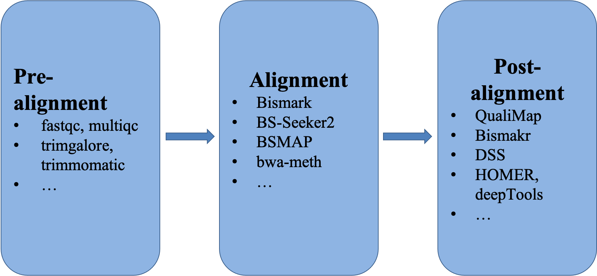

### The overall workflow.

### Pre-alignment

**1\.** Let's create the working directory and get the raw sequencing data and the reference genome. 

First, we are going to get into your own directory and create sub-directories for the raw data.

    cd /share/workshop/epigenetics_workshop/$USER

    mkdir Methylation; cd Methylation
    mkdir 00-RawData; cd 00-RawData

Then, let's get the raw data. We are going to create a soft link to the data in my directory. This way, we can save both disk space and time. There are Illumina Hiseq2500 paired-end 126bp data for six mouse rod photoreceptor cell whole genome bisulfite sequencing samples. The first three samples are from 3 month old male mice and the following three are from 24 month old male mice. The data used in this hands-on session is from [this paper](https://www.sciencedirect.com/science/article/pii/S2211124720304253#sec4). The data was downloaded from GEO and subsampled to only the reads that map to chromosome 18 for computing time consideration.

    ln -s /share/biocore/projects/Internal_Jessie_UCD/Workshops/Epigenetics/00-RawData/Subsampled/* .

In order to do mapping later on, we need the reference genome. These data are for mouse, so we are going to use the mouse reference genome GRCh38 (mm10). Since we have subsetted the sequencing data to chr18, we will only use chr18 as the reference to reduce runtime.

    cd /share/workshop/epigenetics_workshop/$USER/Methylation; mkdir References; cd References
    ln -s /share/workshop/epigenetics_workshop/jli/Methylation/References/chr18.fa .

I always like to have a separate directory where I keep all of my scripts for running the workflow, as well as one subdirectory for storing the output from slurm.

    cd /share/workshop/epigenetics_workshop/$USER/Methylation; mkdir scripts; cd scripts
    ls ../00-RawData/*_1.fastq |cut -d'/' -f3 - |cut -d'_' -f1 - > allsamples.txt
    mkdir slurmout

---

**2\.** After obtaining the raw sequencing data and before starting alignment, it's best to look at the raw data and know what quality of data one has in hand and whether there are unexpected issues. The information one gets from looking at the raw data will help to make decision on whether more data/better data should be generated. [FastQC](https://www.bioinformatics.babraham.ac.uk/projects/fastqc/) is a commonly used tool. However, FastQC has been developed to look at one fastq file at a time. Fortunately, there is a very nice tool that one can use - [MultiQC](https://multiqc.info/). MultiQC can take the results of FastQC and compile them in one report. First, we are going to run FastQC on all fastq files. You can get the script to run FastQC by the following command.

    cd /share/workshop/epigenetics_workshop/$USER/Methylation/scripts
    cp /share/workshop/epigenetics_workshop/jli/Methylation/scripts/src/fastqc_pre.slurm .

This [fastqc_pre.slurm](https://raw.githubusercontent.com/ucdavis-bioinformatics-training/2020-Epigenetics_Workshop/master/scripts/methylation/fastqc_pre.slurm) script will submit a job to run FastQC on the raw sequencing data for all samples. The command to submit this script is as following.

    sbatch -J fqc.${USER} --array=1-6 fastqc_pre.slurm

After the job has been executed successfully, you should have 6 html files in your 011-Fastqc directory inside your Methylation directory. You can download them to your laptop to take a look at them one by one. However, it provides a better pictures of our samples if one can generate a report that provides the metrics for all samples collectively. This is where MultiQC comes to be useful. One can provide the result of FastQC from all samples to MultiQC and produce one report that has all the metrics in one place. We are going to use the following commands to achieve this goal.

    cd /share/workshop/epigenetics_workshop/$USER/Methylation/scripts
    cp /share/workshop/epigenetics_workshop/jli/Methylation/scripts/src/multiqc_pre.slurm .
    sbatch -J mqc.${USER} multiqc_pre.slurm

The script [multiqc_pre.slurm](https://raw.githubusercontent.com/ucdavis-bioinformatics-training/2020-Epigenetics_Workshop/master/scripts/methylation/multiqc_pre.slurm) script will submit a job to run MultiQC based on the results from FastQC. Upon the successful execution of this script, one should have a subdirectory "multiqc_data" and one html file "multiqc_report.html" inside 011-Fastqc directory. Now we can download this html to our laptop to look at the report. It should look like [this](multiqc_report.html). The MultiQC report that I generated for the original sequencing data without subsampling is [here](multiqc_pre_fulldata_report.html).

---

**3\.** Once we know the quality of our sequencing data and know that the quality metrics for all samples look similar, we are ready to proceed with the quality control step of the analysis. [Trim Galore](https://www.bioinformatics.babraham.ac.uk/projects/trim_galore/) will be used to trim any adapter sequence, low quality bases off the raw sequencing data. Different library prep protocols might require slightly different trimming parameter. For example, this sets of data was bisulfite treated using a kit from Zymo Research and the company recommend to trim read R1 10bp from both ends and trim read R2 20bp from the 5' end and 15bp from the 3' end. What we are going to do in this step is to use this recommendation, as well as trimming any remaining adapter sequences, requiring the minimum base quality to be 30 and the minimum read length to be 30bp. [trimgalore.slurm](https://raw.githubusercontent.com/ucdavis-bioinformatics-training/2020-Epigenetics_Workshop/master/scripts/methylation/trimgalore.slurm)

    cd /share/workshop/epigenetics_workshop/$USER/Methylation/scripts
    cp /share/workshop/epigenetics_workshop/jli/Methylation/scripts/src/trimgalore.slurm .
    sbatch -J tg.${USER} --array=1-6 trimgalore.slurm

After qc, one might want to run FastQC and MultiQC again (use [fastqc_pos.slurm]) to check how the data has changed.

    cd /share/workshop/epigenetics_workshop/$USER/Methylation/scripts
    cp /share/workshop/epigenetics_workshop/jli/Methylation/scripts/src/fastqc_post.slurm .
    cp /share/workshop/epigenetics_workshop/jli/Methylation/scripts/src/multiqc_post.slurm .
    jobid=$(sbatch -J fqcp.${USER} --array=1-6 fastqc_post.slurm |cut -d' ' -f4 - )
    sbatch -J mqcp.${USER} --dependency=afterok:${jobid} multiqc_post.slurm
   
After the jobs have been executed successfully, you should have a new directory 012-Fastqc inside your Methylation directory. The MultiQC report is [here](post_multiqc_report.html). The report for the full dataset is [here](multiqc_post_fulldata_report.html).

---

### Alignment

**4\.** Now that the raw sequencing data has gone through the quality control, we can map the qced reads to the reference genome. This step will be done using [Bismark](https://www.bioinformatics.babraham.ac.uk/projects/bismark/). Before mapping can be carried out, the reference genome has to be prepared. This step involves the bisulfite conversion of the genome, as well as the indexing of the converted genomes.

    cd /share/workshop/epigenetics_workshop/$USER/Methylation/scripts
    cp /share/workshop/epigenetics_workshop/jli/Methylation/scripts/src/bismark_pre.slurm .
    sbatch -J bkp.${USER} bismark_pre.slurm

After this step is finished, one should have have a new directory called "Bisulfite_Genome" inside the "References" directory.

Now we are ready to map the qced reads to the reference genome. We use bismark with bowtie2 option and the default values for the rest of the mapping parameters. For those who are interested, [here](https://www.frontiersin.org/articles/10.3389/fpls.2020.00176/full) is a paper that compares several available aligners for bisulfite sequencing data.

    cd /share/workshop/epigenetics_workshop/$USER/Methylation/scripts
    cp /share/workshop/epigenetics_workshop/jli/Methylation/scripts/src/bismark_part1.slurm .
    sbatch -J bm1.${USER} --array=1-6 bismark_part1.slurm

In the [script](https://raw.githubusercontent.com/ucdavis-bioinformatics-training/2020-Epigenetics_Workshop/master/scripts/methylation/bismark_part1.slurm), the first step is to map the reads to the reference genome. The second step removes PCR duplicates among the reads. The third step produces methylation level information for us to check whether there are any position bias and decide whether additional "trimming" is necessary. The final step generates a report for each sample with the metrics on mapping, duplication rate and bias information. These reports can be downloaded to your laptop for viewing [Here](bismark1.html). However, it is more convenient to have the information for all samples in one report. So, we will take advantage of MultQC again to produce a report that includes the metrics for all samples for easy inspection. This can be achieved using the following steps.

    cd /share/workshop/epigenetics_workshop/$USER/Methylation/scripts
    cp /share/workshop/epigenetics_workshop/jli/Methylation/scripts/src/multiqc_bismark.slurm .

**If you have not finished running bismark_part1.slurm and would like to get the results for the downstream analysis, please use the following commands.**

    cd /share/workshop/epigenetics_workshop/$USER/Methylation
    mv 03-Bismakr 03-Bismark.${USER}
    mv 04-Methylation 04-Methylation.${USER}
    cp -r /share/workshop/epigenetics_workshop/jli/Methylation/03-Bismark .
    cp -r /share/workshop/epigenetics_workshop/jli/Methylation/04-Methylation .

In order to run MultiQC on the results of bismark, we are going to create a file that lists all of the relevant files and use it as input to MultiQC.

    ls /share/workshop/epigenetics_workshop/${USER}/Methylation/03-Bismark/*_PE_report.txt > input2.fofn
    ls /share/workshop/epigenetics_workshop/${USER}/Methylation/03-Bismark/*.deduplication_report.txt >> input2.fofn
    ls /share/workshop/epigenetics_workshop/${USER}/Methylation/04-Methylation/*.M-bias.txt >> input2.fofn
    ls /share/workshop/epigenetics_workshop/${USER}/Methylation/04-Methylation/*_splitting_report.txt >> input2.fofn
    sbatch -J mqb.${USER} multiqc_bismark.slurm

Once the job finishes successfully, we can download the MultiQC report (inside 04-Methylation) to our laptop to take a look: [here](multiqc_bismark_report.html) is the one I generated. [Here](multiqc_bismark_full_report.html) is the one I generated using the full set of data.

In the MultiQC report, "M-Bias" plot is one important metric to look carefully. If the methylation level is not more or less the same along the read position, then one should consider trimming more bases off. For example, I have generated a MultiQC report for mapping the raw sequencing reads without trimming. [The result](SRR9833662.1.bismark.raw.report.html) demonstrate one potential scenario.

---

**5\.** Once we have the mapping results, we can also check the genomewide coverage using [Qualimap](http://qualimap.conesalab.org/doc_html/index.html). There are two ways to run this tool to generate an aggregated report for all samples. One is to run Qualimap on each sample first and then use the results to produce the aggregated report. The other is to run Qualimap giving mapping results of all samples. We are going to use the first approach in this course.

    cd /share/workshop/epigenetics_workshop/$USER/Methylation/scripts
    cp /share/workshop/epigenetics_workshop/jli/Methylation/scripts/src/qualimap_single.slurm .
    cp /share/workshop/epigenetics_workshop/jli/Methylation/scripts/src/qualimap_multi.slurm .
    jobid=$(sbatch -J qms.${USER} --array=1-6 qualimap_single.slurm |cut -d' ' -f4 - )
    sbatch -J qmm.${USER} --dependency=afterok:${jobid} qualimap_multi.slurm

This tool produces a very nice report on the coverage along the whole genome. [Here](multisampleBamQcReport.html) is the one I created for the complete set of data. [Here](qualimapReport.html) is the report for a single sample.

---

### Post-alignment

**6\.** Now that we have decided that our mapping results look good, we can go ahead and call methylation using Bismark.

    cd /share/workshop/epigenetics_workshop/$USER/Methylation/scripts
    cp /share/workshop/epigenetics_workshop/jli/Methylation/scripts/src/bismark_part2.slurm .
    sbatch -J bm2.${USER} --array=1-6 bismark_part2.slurm

In this [script](https://raw.githubusercontent.com/ucdavis-bioinformatics-training/2020-Epigenetics_Workshop/master/scripts/methylation/bismark_part2.slurm), we run the command "bismark_methylation_extractor", with the option of having the non-CpG sites merged in one file ("--merge_non_CpG"). Because the library is directional, we will use the option "--comprehensive" to pool methylation to single context-dependent files. One very important parameter is "--no_overlap" when the sequencing reads are paired-end. This parameter will prevent the double counting of a methylation in the overlapping portion of the paired-end reads when relevant. In addition, we use "-p/--paired-end" parameter to inform Bismark that our reads are in paired-end format. we use "--mbias_off" to prevent Bismark to calculate the M-bias again, which we have done in the previous step. We also use "--bedgraph" to produce tab delimited files for methylation counts.

In the case where we decide to trim off more bases from looking at the M-bias plot, we can use the options "--ignore", "--ignore_r2", "--ignore_3prime", "--ignore_3prime_r2" to achieve that.

---

**7\.** At this point, there are many avenues one who would like to explore. The first and the most obvious is the differential methylation analysis when one has more than one experimental group. In this case, we have two groups: 3M old rod photoreceptor cells and 24M old rod photoreceptor cells, with three replicates in each group. We are going to use the R package [DSS](http://bioconductor.org/packages/release/bioc/html/DSS.html) to carry out the differential methylation analysis.

First, one has to modify the Bismark bedgraph output a little for DSS. DSS can read in methylation calls in tab delimited files with the columns being "chromosome, pos, count total, count methylated". The output (.bismark.cov.gz) from Bismark is in the format of "chromosome, start, end, methylation percentage, count methylated, count unmethylated".

    cd /share/workshop/epigenetics_workshop/$USER/Methylation/scripts
    cp /share/workshop/epigenetics_workshop/jli/Methylation/scripts/src/gather_rawcounts.slurm .
    sbatch -J cnt.${USER} --array=1-6 gather_rawcounts.slurm

By running this script, files with "CpG.counts.txt" extension will be generated inside 04-Methylation directory.

**Sam has installed these packages in a place where everyone can access, so you should skip this section of running Rpackages.R.** 

    cd /share/workshop/epigenetics_workshop/$USER/Methylation/scripts
    cp /share/workshop/epigenetics_workshop/jli/Methylation/scripts/src/Rpackages.R .
    module load R/4.0.1
    R CMD BATCH Rpackages.R

Once all packages have been successfully installed, we are going to use [this script](https://raw.githubusercontent.com/ucdavis-bioinformatics-training/2020-Epigenetics_Workshop/master/scripts/methylation/report.Rmd) to carry out differential methylation analysis. 

    cd /share/workshop/epigenetics_workshop/$USER/Methylation/
    mkdir 05-DM; cd 05-DM
    cp /share/workshop/epigenetics_workshop/jli/Methylation/scripts/src/report.Rmd .
    cp /share/workshop/epigenetics_workshop/jli/Methylation/scripts/src/run.R .
    R CMD BATCH run.R

[Here](chr18.nb.html) is the report I generated for the subsampled data. [Here](report.nb.html) is the report I generated for the full set of data.

After we got the list of differentially methylated regions, we can run [HOMER](http://homer.ucsd.edu/homer/index.html) to create functional annotation of the regions. HOMER also can do enrichment analysis using the annotation results. Because there is only one differential methylated region found using the subsampled data, we are going to copy my result using the full dataset and then run HOMER with it.

    cd /share/workshop/epigenetics_workshop/$USER/Methylation/05-DM
    cp /share/biocore/projects/Internal_Jessie_UCD/Workshops/Epigenetics/05-DML/Differential_methylation_regions_24Mvs3M.txt .
    cd /share/workshop/epigenetics_workshop/$USER/Methylation/scripts
    cp /share/workshop/epigenetics_workshop/jli/Methylation/scripts/src/homer.slurm .
    sbatch -J hm.${USER} homer.slurm

[Here](anno.full.txt) is the annotation for the DMRs.

---

**8\.** CpG methylation has been indicated to regulate gene expressions, with evidence of higher methylation level at promoter regions correlated to low or no gene expression. So, we are going to look at the methylation levels around gene transcription start sites (TSS). Fortunately, the paper that we got the data from has gene expression data also. I have grabbed the expression data and created the list of genes that are expressed in the 3M rod photoreceptor cells and genes that are not expressed. We are going to use these two sets of genes to get the methylation information, then plot them around the TSS with 2000bp around it.

First, we are going to run "computeMatrix" from [deepTools](https://deeptools.readthedocs.io/en/latest/index.html) to generate methylation matrix around TSS for the three samples of 3M rod photoreceptor cells.

    cd /share/workshop/epigenetics_workshop/$USER/Methylation/scripts
    cp /share/workshop/epigenetics_workshop/jli/Methylation/scripts/src/deeptools.slurm .
    sbatch -J dt.${USER} deeptools.slurm

In the [script](https://raw.githubusercontent.com/ucdavis-bioinformatics-training/2020-Epigenetics_Workshop/master/scripts/methylation/deeptools.slurm), we also run "plotHeatmap" from deepTools to generate a [plot](tss.expressed.png).

As a part of running "computeMatrix" from deepTools, we obtained a file containing the methylation level information for the region of 2000bp around TSS for all genes in the two lists (expressed and not-expressed genes). We are going to use a R script to calculate the average levels at posiitons 2000bp around TSS and plot them.

    cp /share/workshop/epigenetics_workshop/jli/Methylation/scripts/src/plottss.R .
    module load R/4.0.1
    R CMD BATCH plottss.R

At the end, we got a [Methylation_TSS.pdf](Methylation_TSS.pdf) file.

---

**9\.** In the case where one has multiple data types, such as ATAC-Seq or ChIP-Seq, one could try to find some relationship between data types. The most straightforward analysis is to try to find the overlaps between the DMRs and the ATAC-Seq/ChIP-Seq peaks. I have downloaded the ATAC-Seq peaks used in the paper and we will use [bedtools](https://bedtools.readthedocs.io/en/latest/) to find the overlaps.

    cd /share/workshop/epigenetics_workshop/$USER/Methylation/scripts
    ln -s /share/workshop/epigenetics_workshop/jli/Methylation/References/GSM1865011_ATAC-seq_WT_rods_MACS_peaks_rep1.txt ../References/.
    cp /share/workshop/epigenetics_workshop/jli/Methylation/scripts/src/bedtools.slurm .
    sbatch -J bt.${USER} bedtools.slurm

