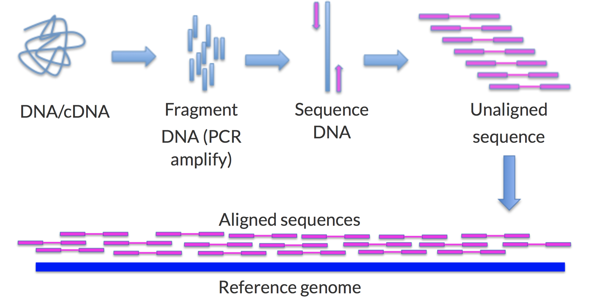
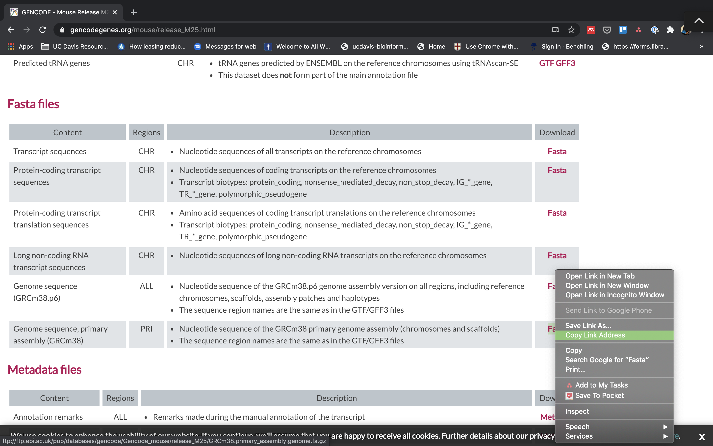
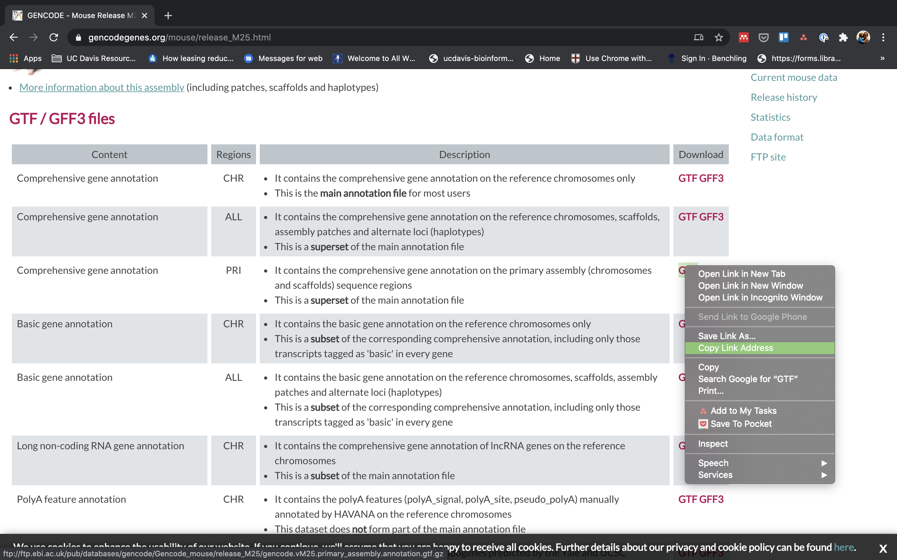
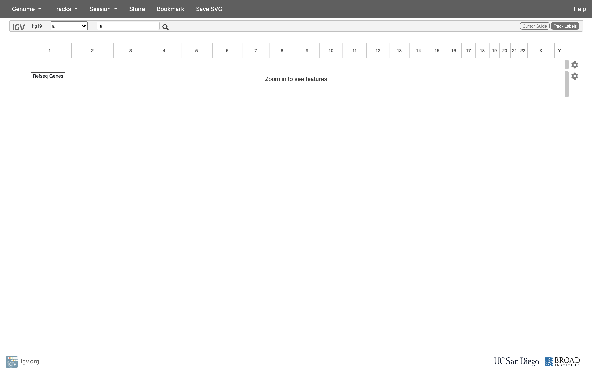
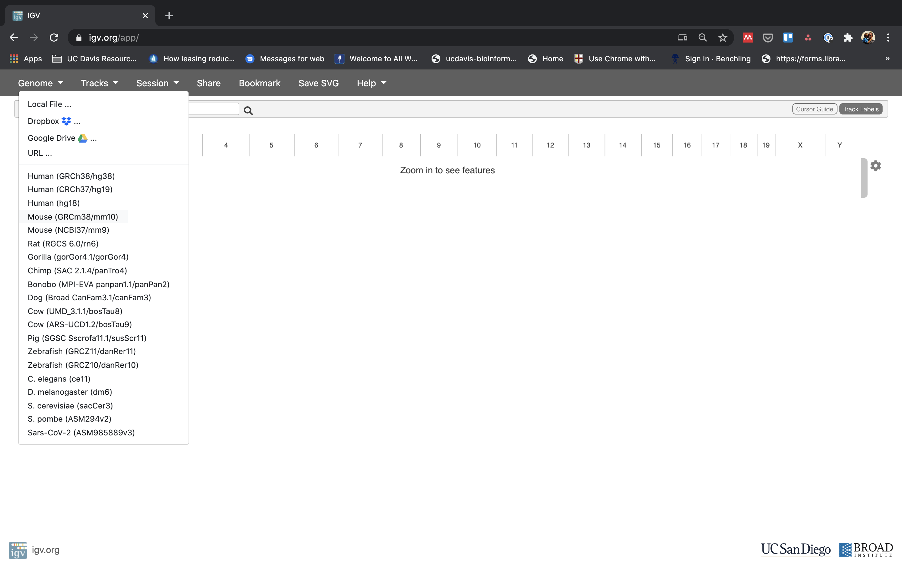
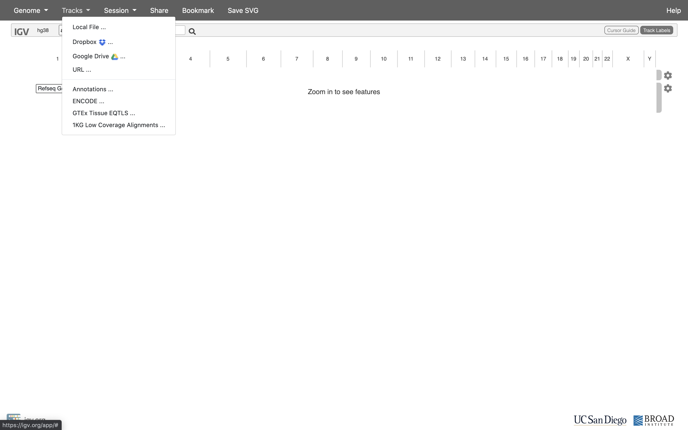
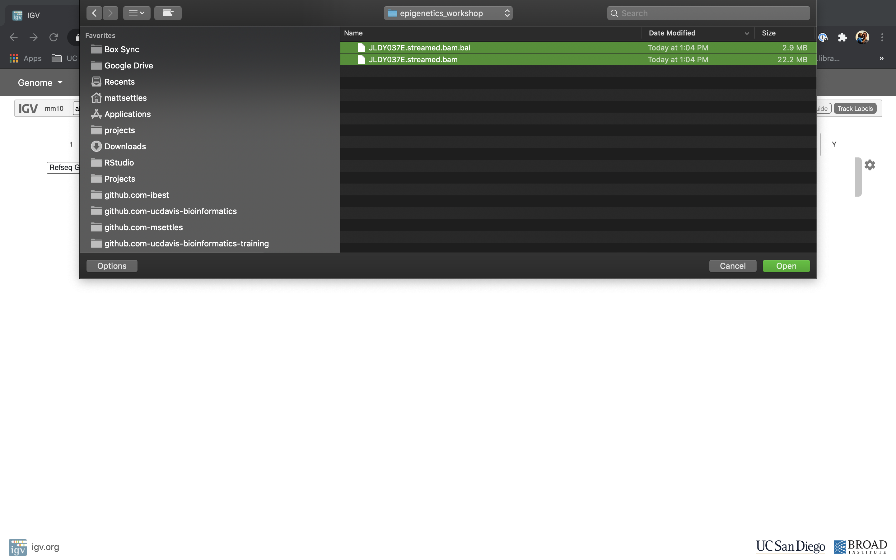
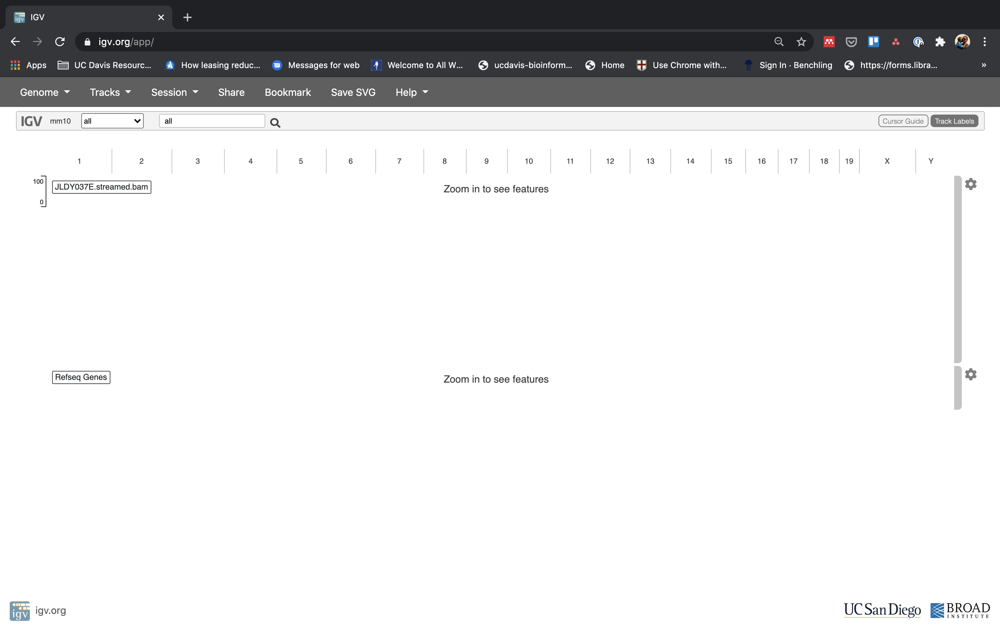
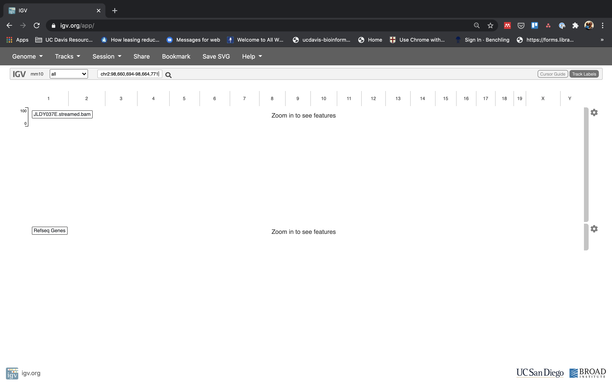
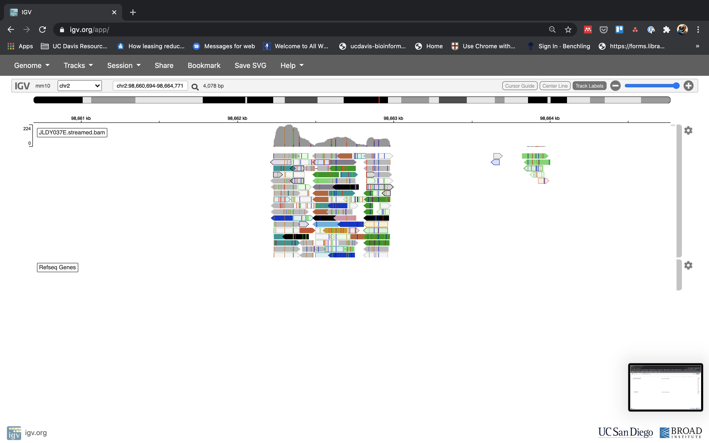

# Alignment & Visualization in IGV

This document assumes [preproc htstream](./01-preproc_htstream.md) has been completed.

**IF** for some reason it didn't finish, is corrupted or you missed the session, you can copy over a completed copy

```bash
cp -r /share/biocore/workshops/2020_Epigenetics/ChIPseq/HTS_testing /share/workshop/epigenetics_workshop/$USER/chipseq_example/.
cp -r /share/biocore/workshops/2020_Epigenetics/ChIPseq/01-HTS_Preproc /share/workshop/epigenetics_workshop/$USER/chipseq_example/.

cp -r /share/biocore/workshops/2020_Epigenetics/ATACseq/01-HTS_Preproc /share/workshop/epigenetics_workshop/$USER/atacseq_example/.
```

## Alignment vs Assembly

**Given sequence data**,

_Assembly seeks to put together the puzzle without knowing what the picture is._

The focus is on the pieces, how they fit together.

_Mapping tries to put together the puzzle pieces directly onto an image of the picture._

The focus is on the puzzle, regions of the puzzle that contain certain characteristics (ex. what background) that will help you place the piece onto the puzzle.  

In mapping the question is more, given a small chunk of sequence, where in the genome did this sequence most likely come from.

The goal then is to find the match(es) with either the “best” edit distance (smallest difference), or all matches with edit distance less than max edit distance. Main issues are:

* Large search space
* Regions of similarity (aka repeats)
* Gaps (INDELS)
* Complexity (RNA, splicing, transcripts)

#### Considerations
* Placing reads in regions that do not exist in the reference genome (reads extend off the end of linearized fragments) [ mitochondrial, plasmids, structural variants, etc.].
* Sequencing errors and genetic variation: alignment between read and true source in genome may have more differences than alignment with some other copy of repeat.
* What if the closest fully sequenced genome is too divergent?
* Placing reads in repetitive regions: Some algorithms only return 1 mapping; If multiple: map quality = 0
* Algorithms that use paired-end information => might prefer correct distance over correct alignment.



### Aligners
Many [alignment algorithms](https://en.wikipedia.org/wiki/List_of_sequence_alignment_software
) to choose from. Examples include:
* Spliced Aligners for RNA
  * STAR
  * HiSAT2 (formerly Tophat [Bowtie2])
  * GMAP/GSNAP
  * SOAPsplice
  * MapSplice
* Aligners that can ’clip’
  * bwa-mem
  * Bowtie2 in local mode

### Genome and Genome Annotation

Genome sequence fasta files and annotation (gff, gtf) files go together! These should be identified at the beginning of analysis.

* Genome fasta files should include all primary chromosomes, unplaced sequences and un-localized sequences, as well as any organelles. Should bet contain any contigs that represent patches, or alternative haplotypes.
* If you expect contamination, or the presence of additional sequence/genome, add the sequence(s) to the genome fasta file.
* Annotation file should be GTF (preferred), and should be the most comprehensive you can find.
  * Chromosome names in the GTF must match those in the fasta file (they don’t always do).
  * Star recommends the Genecode annotations for mouse/human

## Counting reads as a proxy for enrichment

The more you can count (and HTS sequencing systems can count a lot) the better the measure of copy number for even rare transcripts in a population.
Many techniques deal with count data (ex. RNAseq). Reads are mapped to a reference genome, transcripts are detected, and the number of reads that map to a transcript (or gene) are counted (more or less).

Technical artifacts should be considered during counting
* Mapping quality
* Map-ability (uniqueness), the read is not ambiguous
* Properly paired reads

### Alignment concepts

* Multimappers:
  * Reads that align equally well to more than one reference location.
  * Generally, multimappers are discounted in most analysis, and are often discounted in counting applications.
  * Note: multimapper “rescue” is available in some.
* Duplicates (We did this with HTStream):
  * Reads or read pairs arising from the same original library fragment, either during library preparation (PCR duplicates).
  * Generally, duplicates can only be detected reliably with paired-end sequencing.
* Clipping and Splicing  
  
* Inner length, insert size, fragment length  
  
*From https://www.biostars.org/p/106291/*

## Indexing a Reference sequence and annotation

1. First lets make sure we are where we are supposed to be and that the References directory is available.

    ```bash
    cd /share/workshop/epigenetics_workshop/$USER
    mkdir -p References
    ```

Since the references are the same for both projects we'll just create the one directory.

1. To align our data we will need the genome (fasta) and annotation (gtf) for mouse. There are many places to find them, but we are going to get them from the [GENCODE](https://www.gencodegenes.org/mouse/release_M25.html).

    We need to first get the url for the genome and annotation gtf. For most purposes we want to use the PRI (primary) genome chromosome and Basic gene annotation. At the time of this workshop the current version of GENCODE is *25*. You will want to update the scripts to use the current version.

    

    

1. Lets take a look at the help docs for BWA and its subcommands as well:

    ```bash
    module load bwa
    bwa
    ```

1. We are going to use an aligner called ['BWA MEM'](https://arxiv.org/abs/1303.3997) to align the data, but first we need to index the genome. Lets pull down a slurm script to index the mouse GENCODE version of the genome.

    ```bash
    wget https://raw.githubusercontent.com/ucdavis-bioinformatics-training/2020-Epigenetics_Workshop/master/software_scripts/scripts/bwa_index.slurm bwa_index.slurm
    less bwa_index.slurm
    ```

    <div class="script">#!/bin/bash

    #SBATCH --job-name=bam_index # Job name
    #SBATCH --nodes=1
    #SBATCH --ntasks=8
    #SBATCH --time=120
    #SBATCH --mem=40000 # Memory pool for all cores (see also --mem-per-cpu)
    #SBATCH --partition=production
    #SBATCH --account=epigenetics # cluster account to use for the job
    #SBATCH --reservation=epigenetics-workshop # cluster account reservation
    #SBATCH --output=slurm_out/bwa-index_%A.out # File to which STDOUT will be written
    #SBATCH --error=slurm_out/bwa-index_%A.err # File to which STDERR will be written

    start=`date +%s`
    echo $HOSTNAME

    outpath="References"
    mkdir -p ${outpath}

    cd ${outpath}

    wget ftp://ftp.ebi.ac.uk/pub/databases/gencode/Gencode_mouse/release_M25/GRCm38.primary_assembly.genome.fa.gz GRCm38.primary_assembly.genome.fa.gz
    gunzip GRCm38.primary_assembly.genome.fa.gz
    FASTA="GRCm38.primary_assembly.genome.fa"

    wget ftp://ftp.ebi.ac.uk/pub/databases/gencode/Gencode_mouse/release_M25/gencode.vM25.primary_assembly.annotation.gtf.gz gencode.vM25.primary_assembly.annotation.gtf.gz
    gunzip gencode.vM25.primary_assembly.annotation.gtf.gz


    module load bwa/0.7.17

    call="bwa index ${FASTA}"

    echo $call
    eval $call

    end=`date +%s`
    runtime=$((end-start))
    echo $runtime
    </div>

    When you are done, type "q" to exit.

    1. The script uses wget to download the FASTA and GTF files from GENCODE using the links you found earlier.
    1. Uncompresses them using gunzip.
    1. Run bwa in mode index.

1. Run BWA indexing when ready.

    ```bash
    sbatch bwa_index.slurm
    ```

    **IF** For the sake of time, or for some reason it didn't finish, is corrupted, or you missed the session, you can **link** over a completed copy.

    ```bash
    #ln -s /share/biocore/workshops/2020_Epigenetics/Reference/GRCm38.primary_assembly.genome.fa* /share/workshop/epigenetics_workshop/$USER/References/.
    ```

1. Now do the same for the ATACseq experiment

## Alignments

1. We are now ready to try an alignment on our small test dataset:

    ```bash
    cd /share/workshop/epigenetics_workshop/$USER/chipseq_example/HTS_testing
    ```

    and let's run BWA (via srun) on the pair of streamed test files we created earlier:

    ```bash
    srun --time=15:00:00 -n 8 --mem=32g --reservation=epigenetics-workshop --account=epigenetics --pty /bin/bash
    ```

    Once you've been given an interactive session we can run BWA. You can ignore the two warnings/errors and you know your on a cluster node because your server will change. Here you see I'm on tadpole, then after the srun command is successful, I am now on drove-13.

    <div class="output">msettles@tadpole:/share/workshop/msettles/chipseq_example/> HTS_testing$ srun --time=15:00:00 -n 8 --mem=32g --reservation=epigenetics-workshop --account=epigenetics --pty /bin/bash
    srun: job 29372920 queued and waiting for resources
    srun: job 29372920 has been allocated resources
    groups: cannot find name for group ID 2020
    bash: /home/msettles/.bashrc: Permission denied
    msettles@drove-13:/share/workshop/msettles/chipseq_example/> HTS_testing$
    </div>

1. Then run the bwa commands

    ```bash
    module load bwa
    bwa mem -t 8 \
       ../../Reference/GRCm38.primary_assembly.genome.fa \
       JLDY037E.streamed_R1.fastq.gz \
       JLDY037E.streamed_R2.fastq.gz
    ```

    In the command, we are telling bwa to count reads using the genome referencde and input file pair.

    You'll notice the program output the result to *stdout* this is nice because we can add additional processing afterwards, like sorting with samtools. But first lets take a look at the [sam/bam](../filetypes) format.

    ```bash
    module load samtools
    bwa mem -t 8 \
       ../Reference/GRCm38.primary_assembly.genome.fa \
       JLDY037E.streamed_R1.fastq.gz \
       JLDY037E.streamed_R2.fastq.gz | samtools sort -o JLDY037E.streamed.bam -
    ```

    In the directory there should now be a file JLDY037E.streamed.bam that is your alignment in bam format.

    Once finished please 'exit' the srun session. You'll know you were successful when your back on tadpole

    <div class="output">msettles@drove-13:/share/workshop/msettles/chipseq_example/HTS_testing$ exit
    exit
    msettles@tadpole:/share/workshop/msettles/chipseq_example/HTS_testing$
    </div>

###  Now let's take a look at an alignment in IGV.

1.  We first need to index the bam file, will use 'samtools' for this step, which is a program to manipulate SAM/BAM files. Take a look at the options for samtools and 'samtools index'.

    ```bash
    module load samtools
    samtools
    samtools index
    ```

    We need to index the BAM file:

    ```bash
    cd /share/workshop/epigenetics_workshop/$USER/chipseq_example/HTS_testing
    samtools index JLDY037E.streamed.bam
    ```

    **IF** for some reason it didn't finish, is corrupted or you missed the session, you can copy over a completed copy

    ```bash
    #cp -r /share/biocore/workshops/2020_Epigenetics/ChIPseq/HTS_testing/JLDY037E.streamed.bam /share/workshop/epigenetics_workshop/$USER/chipseq_example/HTS_testing/.
    ```

2. Transfer JLDY037E.streamed.bam and JLDY037E.streamed.bam.bai (the index file) to your computer using scp or winSCP, or copy/paste from cat [sometimes doesn't work].

    In a new shell session on my laptop. **NOT logged into tadpole**. Replace [your_username] with your username
    ```bash
    mkdir -p ~/epigenetics_workshop
    cd ~/epigenetics_workshop
    scp [your_username]@tadpole.genomecenter.ucdavis.edu:/share/workshop/epigenetics_workshop/[your_username]/chipseq_example/HTS_testing/JLDY037E.streamed.bam* .
    ```

1. Now we are ready to use IGV.

    Go to the [IGV page at the Broad Institute](http://software.broadinstitute.org/software/igv/).

    

    And then navigate to the download page, [IGV download](http://software.broadinstitute.org/software/igv/download)

    

    Here you can download IGV for your respective platform (Window, Mac OSX, Linux), but we are going to use the web application they supply, [IGV web app](https://igv.org/app).

    

1. The first thing we want to do is load the Human genome. Click on "Genomes" in the menu and choose "Human (GRCm38/mm10)".

    

1. Now let's load the alignment bam and index files. Click on "Tracks" and choose "Local File ...".

    

    Navigate to where you transferred the bam and index file and select them **both**.

    

    Now your alignment is loaded. Any loaded bam file aligned to a genome is called a "track".

    

1. Lets take a look at the alignment associated with the region __chr2:98,660,694-98,664,771__. If you don't see any reads, this likely means your in the wrong genome, double check that it says **mm10** in the top left.

    

    

    You can zoom in by clicking on the plus sign (top right) or zoom out by clicking the negative sign. You also may have to move around by clicking and dragging in the BAM track window.

    You can also zoom in by clicking and dragging across the number line at the top. That section will highlight, and when you release the button, it will zoom into that section. Play around with IGV for a few minutes, check out the different settings. You can use IGV to visualize and validate your expectations in your alignments.


## Running BWA on the ChIP experiment

1. We can now run BWA across all samples on the real data using a SLURM script, [map_bwa.slurm](../software_scripts/scripts/map_bwa.slurm), that we should take a look at now.

    ```bash
    cd /share/workshop/epigenetics_workshop/$USER/chipseq_example  # We'll run this from the main directory
    wget https://raw.githubusercontent.com/ucdavis-bioinformatics-training/2020-Epigenetics_Workshop/master/software_scripts/scripts/map_bwa.slurm
    less map_bwa.slurm
    ```

    <div class="script">#!/bin/bash
    #
    #SBATCH --job-name=map_bwa # Job name
    #SBATCH --nodes=1
    #SBATCH --ntasks=20 # Number of cores
    #SBATCH --mem=16000 # Memory pool for all cores (see also --mem-per-cpu)
    #SBATCH --time=1-00
    #SBATCH --array=1-12
    #SBATCH --partition=production # Partition to submit to
    #SBATCH --output=slurm_out/map_hts_bwa-%A_%a.out # File to which STDOUT will be written
    #SBATCH --error=slurm_out/map_hts_bwa-%A_%a.err # File to which STDERR will be written
    #SBATCH --mail-type=ALL # Type of email notification- BEGIN,END,FAIL,ALL
    #SBATCH --mail-user=settles@ucdavis.edu # Email to which notifications will be sent

    start=`date +%s`
    echo $HOSTNAME
    echo "My SLURM_ARRAY_TASK_ID: " $SLURM_ARRAY_TASK_ID

    inpath=01-HTS_Preproc
    sample=`sed "${SLURM_ARRAY_TASK_ID}q;d" samples.txt | awk -F '\t'  '{print $1}'`
    r1=${inpath}/${sample}/${sample}*_R1*.fastq.gz
    r2=${inpath}/${sample}/${sample}*_R2*.fastq.gz

    outpath='02-BWA'
    [[ -d ${outpath} ]] || mkdir ${outpath}
    [[ -d ${outpath}/${sample} ]] || mkdir ${outpath}/${sample}

    echo "SAMPLE: ${sample}"

    THREADS=${SLURM_NTASKS}
    MEM=$(expr ${SLURM_MEM_PER_NODE} / 1024)
    MAPTHREADS=$(expr ${THREADS} - 6)
    SORTTHREADS=$(expr ${THREADS} - ${MAPTHREADS})

    #THREADS=20
    #MAPTHREADS=14
    #SORTTHREADS=6
    #MEM=48

    module load bwa/0.7.17
    module load samtools/1.9

    output=${outpath}/${sample}/${sample}_bwa.bam
    mapfasta=../References/GRCm38.primary_assembly.genome.fa

    call="bwa mem -t ${MAPTHREADS} \
     -R '@RG\tID:${sample}\tSM:${new_id}\tPL:ILLUMINA\tDS:Paired' \
     ${mapfasta} ${r1} ${r2} \
     | samtools sort -m 768M --threads ${SORTTHREADS} -o ${output} -"
    echo $call
    eval $call

    call="samtools index -@ ${THREADS} ${output}"
    echo $call
    eval $call

    call="samtools idxstats ${output} > ${output}.idxstats"
    echo $call
    eval $call

    call="samtools flagstat -@ ${THREADS} ${output} > ${output}.flagstat"
    echo $call
    eval $call

    call="samtools stats -@ ${THREADS} ${output} > ${output}.stats"
    echo $call
    eval $call

    end=`date +%s`

    runtime=$((end-start))

    echo $runtime
    </div>

    When you are done, type "q" to exit.

    There are alot of things happening here:
    1.  We first setup the environment.
    1.  Map with BWA piping to samtools sort.
    1.  Then use samtools to:
        1. index
        1. flagstats
        1. idxstats
        1. stats

2. After looking at the script, lets run it.

    ```bash
    sbatch map_bwa.slurm  # moment of truth!
    ```

    We can watch the progress of our task array using the 'squeue' command. Takes about 1:30 hours to process each sample.

    ```sbatch
    squeue -u $USER  # use your username
    ```
3. Now do the same for the ATACseq experiment.

## MultiQC QA/QC Summary of the mapping results.

Finally lets use [MultiQC](https://multiqc.info/) to generate a summary of our output.

```bash
## Run multiqc to collect statistics and create a report:
cd /share/workshop/epigenetics_workshop/$USER/chipseq_example
module load multiqc/htstream.dev0
multiqc -i ChIPseq-mapping-report -o 02-BWA-ChIPseq-report ./02-BWA
```

**Do the same for the ATACseq experiment**

Transfer ChIPseq-mapping-report_multiqc_report.html and ATACseq-mapping-report_multiqc_report.html to your computer and open it in a web browser.

Or in case of emergency, download this copy: [ChIPseq-mapping-report_multiqc_report.html](ChIPseq-mapping-report_multiqc_report.html) and [HTSMultiQC-mapping-report_multiqc_report.html](ATACseq-mapping-report_multiqc_report.html) for the ATACseq


**Questions:**
1. Look at the script `map_bwa.slurm`. What does the `array=1-7` mean, why is it used, and what is the usage of it in the script itself?
2. Look through the files in an output directory and check out what is present and discuss what each of them mean. (for example: `cd /share/workshop/epigenetics_workshop/$USER/chipseq_example/02-BWA/JLDY037E` )
3. Come up with a brief command you might use to check that all of the sample alignments using BWA have a reasonable output and/or did not produce any errors (recall from htstream checks).
4. Open `JLDY037E_bwa.bam.idxstats` in excel (or excel like application), and review. The table that this script creates ("summary_star_alignments.txt") can be pulled to your laptop via 'scp', or WinSCP, etc., and imported into a spreadsheet. Do read counts align according to chromosome size? Discuss ...
5. If time, find some other regions/genes with high alignment count using IGV with your group. Where do they occur relative to genes?
