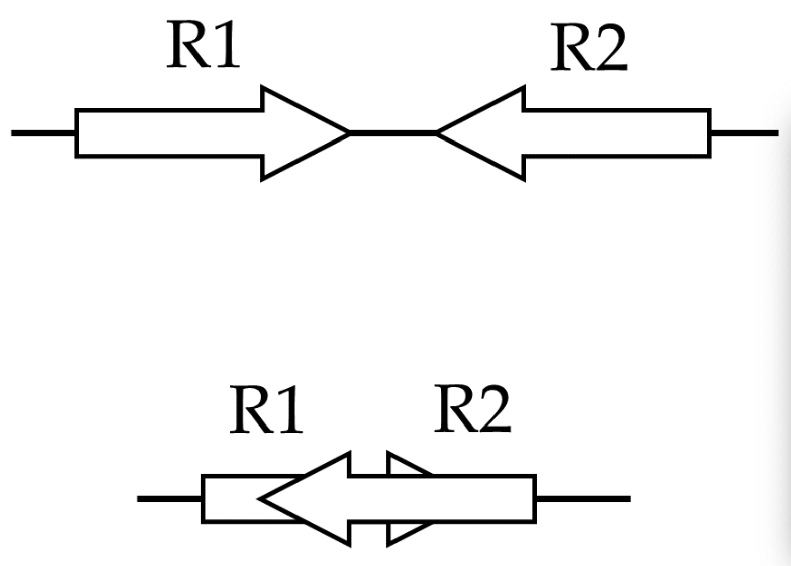

# Filtering our Alignments

This document assumes [mapping with bwa](./02-alignment.md) has been completed.

**IF** for some reason it didn't finish, is corrupted or you missed the session, you can copy over a completed copy

```bash
#cp -r /share/biocore/workshops/2020_Epigenetics/ChIPseq/HTS_testing /share/workshop/epigenetics_workshop/$USER/chipseq_example/.
#cp -r /share/biocore/workshops/2020_Epigenetics/ChIPseq/02-BWA /share/workshop/epigenetics_workshop/$USER/chipseq_example/.
#cp -r /share/biocore/workshops/2020_Epigenetics/ATACseq/02-BWA /share/workshop/epigenetics_workshop/$USER/atacseq_example/.
```

1. Purpose of filtering

The purpose of filtering our alignments is primarily noise reduction. We want to remove alignements that are either suspect, misaligned and/or unwanted (Ex. Mitochondrial genome in ATACseq).

For both datasets we are going to filter out all alignments before peak calling. For these experiments that means.

1. Filter out all secondary alignements (produce by BWA MEM).
2. Filter out any **not** properly paired reads.
    

    You would **not** use this filter if you had SE reads.
3. Filter out any alignments whos mapping quality is < 30 (aka multimappers or misaligned).

In addition to those alignment filters, we also will filter reads aligned to regions from a blacklist. Blacklisted regions represent genomic regions that tend to show *artificially* high signal (excessive unstructured anomalous reads mapping). These regions are often found for some types of repeat regions such as centromeres, telomeres and satellite repeats and can appear as unique high-qulaity alignments, so simple filters applied above do not remove them. There are multiple "blacklists" in existance, including those from ENCODE and modENCODE consortia.

The version we will be using here is form the [paper](https://www.nature.com/articles/s41598-019-45839-z) and we'll use [this](https://github.com/Boyle-Lab/Blacklist/blob/master/lists/mm10-blacklist.v2.bed.gz) specific mouse blacklist

First lets download and uncompress the blacklist to our References folder, then take a look. This is the [bam format](../../filetypes).

```bash
cd /share/workshop/epigenetics_workshop/$USER/References
wget https://github.com/Boyle-Lab/Blacklist/raw/master/lists/mm10-blacklist.v2.bed.gz mm10-blacklist.v2.bed.gz
gunzip mm10-blacklist.v2.bed.gz
less mm10-blacklist.v2.bed
```

To perfom these tasks we are going to use samtools and bedtools utilities.

1. Lets go back and practice on our small dataset.

    ```bash
    cd /share/workshop/epigenetics_workshop/$USER/chipseq_example/HTS_testing

    module load samtools
    samtools view -F 2048 -f 2 -q 30 -b JLDY037E.streamed.bam | samtools sort -o JLDY037E.streamed_filtered.bam
    ```

    To see what it did, lets use samtools flagstat before and after.

    ```bash
    samtools flagstat JLDY037E.streamed.bam
    samtools flagstat JLDY037E.streamed_filtered.bam
    ```

    **Questions**
    1.  Which paremeter removed multimappers?
    2.  Which *keeps* only proper pairs
    3.  Which *removes* secondary alignments.


2. Now lets see how to screen out the blasklisted regions.

    In order to remove the blacklisted regions specified in the bed file, we first have to index our bam file, and then we can intersect (removing) those reads which intersect with the secified bam file. We will use [bedtools2](https://github.com/arq5x/bedtools2) for this.

    ```bash
    module load bedtools2

    samtools index JLDY037E.streamed_filtered.bam

    bedtools intersect -abam JLDY037E.streamed_filtered.bam -b /share/workshop/epigenetics_workshop/$USER/References/mm10-blacklist.v2.bed -v | samtools sort -o JLDY037E.streamed_filtered_blacklisted.bam -
    ```

    You'll get a Warning.
    ```
    ***** WARNING: File JLDY037E.streamed_filtered.bam has inconsistent naming convention for record:
    GL456210.1	75262	75413	J00113:398:HNNJJBBXX:5:1101:7923:15258/2	41	+

    ***** WARNING: File JLDY037E.streamed_filtered.bam has inconsistent naming convention for record:
    GL456210.1	75262	75413	J00113:398:HNNJJBBXX:5:1101:7923:15258/2	41	+
    ```
    Which implies mismatch name between the bam and bed, here we can safely ignore.

    To see what it did, lets use samtools flagstat before and after.

    ```bash
    samtools flagstat JLDY037E.streamed_filtered.bam
    samtools flagstat JLDY037E.streamed_filtered_blacklisted.bam
    ```

## Filtering the ChIP experiment

1. We can now run our filtering across all samples on the real data using a SLURM script, [filter-chipseq.slurm](../../software_scripts/scripts/filter-chipseq.slurm), that we should take a look at now.

    ```bash
    cd /share/workshop/epigenetics_workshop/$USER/chipseq_example  # We'll run this from the main directory

    wget https://raw.githubusercontent.com/ucdavis-bioinformatics-training/2020-Epigenetics_Workshop/master/software_scripts/scripts/filter-chipseq.slurm filter-chipseq.slurm
    less filter-chipseq.slurm
    ```

    <div class="script">#!/bin/bash
    #
    #SBATCH --job-name=filter-chip # Job name
    #SBATCH --nodes=1
    #SBATCH --ntasks=1 # Number of cores
    #SBATCH --mem=4000 # Memory pool for all cores (see also --mem-per-cpu)
    #SBATCH --time=6:00:00
    #SBATCH --array=1-8
    #SBATCH --partition=production # Partition to submit to
    #SBATCH --account=epigenetics # cluster account to use for the job
    #SBATCH --reservation=epigenetics-workshop # cluster account reservation
    #SBATCH --output=slurm_out/filter-%A_%a.out # File to which STDOUT will be written
    #SBATCH --error=slurm_out/filter-%A_%a.err # File to which STDERR will be written
    #SBATCH --mail-type=ALL # Type of email notification- BEGIN,END,FAIL,ALL
    #SBATCH --mail-user=settles@ucdavis.edu # Email to which notifications will be sent

    start=`date +%s`
    echo $HOSTNAME
    echo "My SLURM_ARRAY_TASK_ID: " $SLURM_ARRAY_TASK_ID

    inpath=02-BWA
    sample=`sed "${SLURM_ARRAY_TASK_ID}q;d" samples.txt | awk -F '\t'  '{print $1}'`
    bam=${inpath}/${sample}/${sample}_bwa.bam

    outpath='03-Filter'
    [[ -d ${outpath} ]] || mkdir ${outpath}
    [[ -d ${outpath}/${sample} ]] || mkdir ${outpath}/${sample}

    echo "SAMPLE: ${sample}"

    module load samtools/1.9
    module load deeptools/3.3.1
    module load bedtools2/2.29.2

    output=${outpath}/${sample}/${sample}

    THREADS=${SLURM_NTASKS}
    #THREADS=1

    blacklist_bed=/share/biocore/workshops/2020_Epigenetics/Reference/mm10-blacklist.v2.bed

    call="samtools view -F 2048 -f 2 -q 30 -b ${bam} | samtools sort -m 768M --threads ${THREADS} -o ${output}_filtered.bam -"
    echo $call
    eval $call

    call="samtools index -@ ${THREADS} ${output}_filtered.bam"
    echo $call
    eval $call

    call="bedtools intersect -abam ${output}_filtered.bam -b ${blacklist_bed} -v | samtools sort -m 768M --threads ${THREADS} -o ${output}_filtered_blacklisted.bam -"
    echo $call
    eval $call

    call="samtools index -@ ${THREADS} ${output}_filtered_blacklisted.bam"
    echo $call
    eval $call

    call="samtools idxstats ${output}_filtered_blacklisted.bam > ${output}_filtered_blacklisted.bam.idxstats"
    echo $call
    eval $call

    call="samtools flagstat -@ ${THREADS} ${output}_filtered_blacklisted.bam > ${output}_filtered_blacklisted.bam.flagstat"
    echo $call
    eval $call

    call="samtools stats -@ ${THREADS} ${output}_filtered_blacklisted.bam > ${output}_filtered_blacklisted.bam.stats"
    echo $call
    eval $call

    end=`date +%s`

    runtime=$((end-start))

    echo $runtime
    </div>

    When you are done, type "q" to exit.

    There are alot of things happening here:
    1.  We first setup the environment.
    1.  Then we use samtools to filter reads and sort.
    1.  Intersect the blacklist and sort.
    1.  Finally use samtools to:
        1. index
        1. flagstats
        1. idxstats
        1. stats

2. After looking at the script, lets run it.

    ```bash
    sbatch filter-chipseq.slurm  # moment of truth!
    ```

    We can watch the progress of our task array using the 'squeue' command. Takes about 1:30 hours to process each sample.

    ```sbatch
    squeue -u $USER  # use your username
    ```

## Now do the same for the ATACseq experiment.

We will perform the same filters as we did with the ChIP Seq experiment with 2 additional features:

* Remove organelles genomes (Mitochondrial, Chloroplasts).The organelle genomes are more accessible due to the lack of chromatin packaging and are not interesting.

We'll remove the MT reads by selecting all chromosomes *NOT* MT using the samtools line

```
module load samtools
cd /share/workshop/epigenetics_workshop/$USER/atacseq_example
cat 02-BWA/JLAC003A/JLAC003A_bwa.bam.idxstats
cat 02-BWA/JLAC003A/JLAC003A_bwa.bam.idxstats | cut -f 1 | grep -v chrM | xargs samtools view -b  02-BWA/JLAC003A/JLAC003A_bwa.bam -o exclude_chrM.bam
samtools idxstats exclude_chrM.bam
```

*Question*
1. How many Mitochondrial reads were there before the screen?
2. How many after?
3. What is the xargs command?
4. Break this command down what does "cat 02-BWA/JLAC003A/JLAC003A_bwa.bam.idxstats | cut -f 1 | grep -v chrM" produce?

* Perform a read shift for ATACseq. In order to achieve base-pair resolution for TF footprint and motif-related analyses. Reads should be shifted + 4 bp for the positive strand reads and − 5 bp for negative strand reads, to account for the 9-bp duplication created by DNA repair of the nick by Tn5 transposase.

We'll use the Deeptools subapplication alignmentSieve mode --ATACshift to perform this.

```
module load samtools
module load deeptools
cd /share/workshop/epigenetics_workshop/$USER/atacseq_example
samtools view exclude_chrM.bam | head -n 2 # first read pair
samtools index exclude_chrM.bam
alignmentSieve --ATACshift --bam exclude_chrM.bam --outFile exclude_chrM_shifted.bam
samtools view exclude_chrM_shifted.bam | head -n 2
```


1. We can now run our filtering across all samples on the real data using a SLURM script, [filter-atacseq.slurm](../../software_scripts/scripts/filter-atacseq.slurm), that we should take a look at now.

    ```bash
    cd /share/workshop/epigenetics_workshop/$USER/atacseq_example  # We'll run this from the main directory

    wget https://raw.githubusercontent.com/ucdavis-bioinformatics-training/2020-Epigenetics_Workshop/master/software_scripts/scripts/filter-atacseq.slurm filter-atacseq.slurm
    less filter-atacseq.slurm
    ```

    <div class="script">#!/bin/bash
    #
    #SBATCH --job-name=filter-atac # Job name
    #SBATCH --nodes=1
    #SBATCH --ntasks=1 # Number of cores
    #SBATCH --mem=16000 # Memory pool for all cores (see also --mem-per-cpu)
    #SBATCH --time=6:00:00
    #SBATCH --array=1-6
    #SBATCH --partition=production # Partition to submit to
    #SBATCH --account=epigenetics # cluster account to use for the job
    #SBATCH --reservation=epigenetics-workshop # cluster account reservation
    #SBATCH --output=slurm_out/filter-%A_%a.out # File to which STDOUT will be written
    #SBATCH --error=slurm_out/filter-%A_%a.err # File to which STDERR will be written
    #SBATCH --mail-type=ALL # Type of email notification- BEGIN,END,FAIL,ALL
    #SBATCH --mail-user=settles@ucdavis.edu # Email to which notifications will be sent

    start=`date +%s`
    echo $HOSTNAME
    echo "My SLURM_ARRAY_TASK_ID: " $SLURM_ARRAY_TASK_ID

    inpath=02-BWA
    sample=`sed "${SLURM_ARRAY_TASK_ID}q;d" samples.txt | awk -F '\t'  '{print $1}'`
    bam=${inpath}/${sample}/${sample}_bwa.bam

    outpath='03-Filter'
    [[ -d ${outpath} ]] || mkdir ${outpath}
    [[ -d ${outpath}/${sample} ]] || mkdir ${outpath}/${sample}

    echo "SAMPLE: ${sample}"

    module load samtools/1.9
    module load deeptools/3.3.1
    module load bedtools2/2.29.2

    output=${outpath}/${sample}/${sample}

    THREADS=${SLURM_NTASKS}
    #THREADS=1

    blacklist_bed=/share/biocore/workshops/2020_Epigenetics/Reference/mm10-blacklist.v2.bed

    call="alignmentSieve --ATACshift --bam ${bam} --outFile ${output}_shifted.bam"
    echo $call
    eval $call

    call="samtools sort -m 768M --threads ${THREADS} -o ${output}_shifted_sort.bam ${output}_shifted.bam"
    echo $call
    eval $call

    call="samtools index -@ ${THREADS} ${output}_shifted_sort.bam"
    echo $call
    eval $call

    call="cat ${bam}.idxstats |  cut -f 1 | grep -v chrM | xargs samtools view -F 2048 -f 2 -q 30 -b ${output}_shifted_sort.bam | samtools sort -m 768M --threads ${THREADS} -o ${output}_shifted_filtered.bam -"
    echo $call
    eval $call

    call="samtools index -@ ${THREADS} ${output}_shifted_filtered.bam"
    echo $call
    eval $call

    call="bedtools intersect -abam ${output}_shifted_filtered.bam -b ${blacklist_bed} -v | samtools sort -m 768M --threads ${THREADS} -o ${output}_shifted_filtered_blacklisted.bam -"
    echo $call
    eval $call

    call="samtools index -@ ${THREADS} ${output}_shifted_filtered_blacklisted.bam"
    echo $call
    eval $call

    call="samtools idxstats ${output}_shifted_filtered_blacklisted.bam > ${output}_shifted_filtered_blacklisted.bam.idxstats"
    echo $call
    eval $call

    call="samtools flagstat -@ ${THREADS} ${output}_shifted_filtered_blacklisted.bam > ${output}_shifted_filtered_blacklisted.bam.flagstat"
    echo $call
    eval $call

    end=`date +%s`

    runtime=$((end-start))

    echo $runtime
    </div>

    When you are done, type "q" to exit.

    Again there are alot of things happening here:
    1.  We first setup the environment.
    1.  Then we use ['alignmentSieve --ATACshift'](https://deeptools.readthedocs.io/en/develop/content/tools/alignmentSieve.html) to perform the ATAC shift.
    1.  samtools sort and index.
    1.  Then we use samtools to filter reads and sort (and the MT reads).
    1.  Intersect the blacklist and sort.
    1.  Finally use samtools to:
        1. index
        1. flagstats
        1. idxstats
        1. No **stats** as maybe alignment Sieve breaks the bam?

    **QUESTIONS**
    1. How are the Mitochondrial reads being removed?
    2. How many bam files do we have?

2. After looking at the script, lets run it.

    ```bash
    sbatch filter-atacseq.slurm  # moment of truth!
    ```

    We can watch the progress of our task array using the 'squeue' command. Takes about 1:30 hours to process each sample.

    ```sbatch
    squeue -u $USER  # use your username
    ```

**NOTE:**
It is very unfortunate that some of these applications don't allow you stream the bam result between applications, resulting in intermediate files. Once your confident your final bam is good, remove those intermediate files.

## MultiQC QA/QC Summary of the filter results.

Finally lets use [MultiQC](https://multiqc.info/) to generate a summary of our output.

```bash
## Run multiqc to collect statistics and create a report:
cd /share/workshop/epigenetics_workshop/$USER/chipseq_example
module load multiqc/htstream.dev0
multiqc -i ChIPseq-filter-report -o 03-Filter-ChIPseq-report ./03-Filter
```

**Do the same for the ATACseq experiment**


Transfer ChIPseq-filter-report_multiqc_report.html and ATACseq-filter-report_multiqc_report.html to your computer and open it in a web browser.

Or in case of emergency, download this copy: [ChIPseq-filter-report_multiqc_report.html](ChIPseq-filter-report_multiqc_report.html) and [HTSMultiQC-filter-report_multiqc_report.html](ATACseq-filter-report_multiqc_report.html) for the ATACseq
