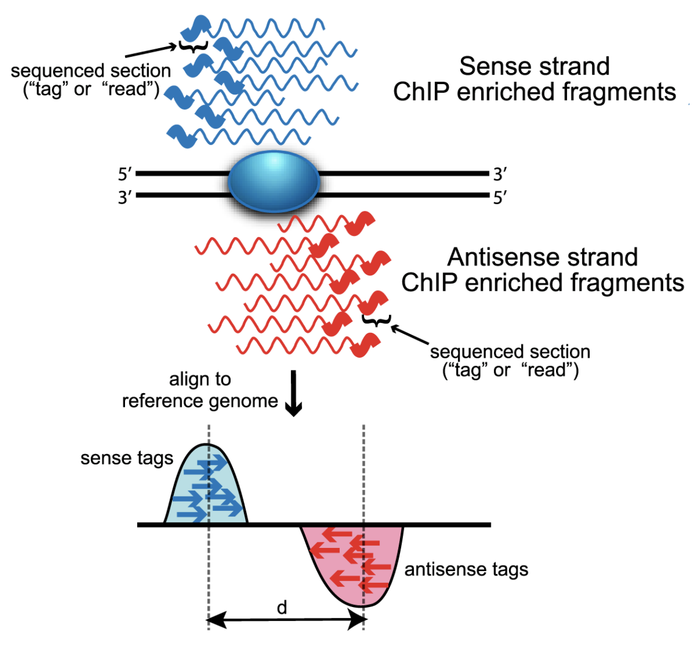

# Calling Peaks using MACS2

This document assumes [filtering of samples](./03-filter.md) has been completed.

**IF** for some reason it didn't finish, is corrupted or you missed the session, you can copy over a completed copy

```bash
#cp -r /share/biocore/workshops/2020_Epigenetics/ChIPseq/03-Filter /share/workshop/epigenetics_workshop/$USER/chipseq_example/.
#cp -r /share/biocore/workshops/2020_Epigenetics/ATACseq/03-Filter /share/workshop/epigenetics_workshop/$USER/atacseq_example/.
```
## Model-based Analysis of ChIP-Seq (MACS2)
MACS2 is a tool for identifying "Peaks" in such data as ChIPseq and ATACseq. MACS captures the influence of genome complexity to evaluate the significance of enriched regions.

For ChIP-seq experiments, what we observe from the alignment files is a strand asymmetry with read densities on the +/- strand, centered around the binding site. The 5’ ends of the selected fragments will form groups on the positive- and negative-strand. The distributions of these groups are then assessed using statistical measures and compared against background (input or mock IP samples) to determine if the site of enrichment is likely to be a real binding site.



From [Wilbanks and Faccioti, PLoS One 2010](https://journals.plos.org/plosone/article?id=10.1371/journal.pone.0011471)


1. Sliding a window of length 2 x bandwidth (= half of estimated sonication size) across genome and determine read counts
2. Retain windows with counts > MFOLD (fold-enrichment of treatment/back-ground)
3. PEAKS: probability of an enrichment being stronger than expected
    *   H0: reads are randomly distributed throughout the genome following a Poisson distribution
    *   Determine the background distribution (λ) by sliding a window of size 2x fragment size across the background to estimate the local coverage

    


1. First lets get ready to run MACS2 and look at the help documentation. We'll save these results into the folder macs_test.

    ```bash
    cd /share/workshop/epigenetics_workshop/$USER/chipseq_example  # We'll run this from the main directory

    module load macs2
    mkdir macs_test
    macs2 callpeak -h
    ```

    *Questions*
    1. What version of MACS2 is this? Is it the most current version?
    1. What parameters are required.

2. Next lets try and run MACS again the input sample on a test sample.

    Here the option -t specified the "test" sample (JLDY037G) and -c the "control" sample (JLDYO37L aka "Input").

    ```bash
    macs2 callpeak  -t 03-Filter/JLDY037G/JLDY037G_filtered_blacklisted.bam -c 03-Filter/JLDY037L/JLDY037L_filtered_blacklisted.bam -f BAMPE  -n macs_test/JLDY037G_input  -g mm  --keep-dup all
    ```

    *Questions*
    1. What does the -g and --keep-dup parameters do?
    2. How many files did this command produce.

    Lets count the number of peaks we found.

    ```bash
    wc -l macs_test/JLDY037G_input_peaks.narrowPeak
    ```

    **Spoiler Alert, we get Zero peaks.**

    *Questions*
    1. Go back through our QA/QC, how did this sample look?
    2. What might be a possible explaination for this?

1. Lets do the same, but this time with the IGG sample (JLDY037L) as control.

    ```bash
    macs2 callpeak  -t 03-Filter/JLDY037G/JLDY037G_filtered_blacklisted.bam -c 03-Filter/JLDY037L/JLDY037L_filtered_blacklisted.bam -f BAMPE  -n macs_test/JLDY037G_igg  -g mm  --keep-dup all
    ```

    Lets count the number of peaks we found.

    ```bash
    wc -l macs_test/JLDY037G_igg_peaks.narrowPeak
    ```

    **Spoiler Alert, we get Zero peaks.**
    *Questions*
    1. Go back through our QA/QC, how did this sample look?
    2. What might be a possible explaination for this?

1. Lets do the same again, but this time with the raw IGG sample (JLDY037L) as control. I mapped the raw fastq data for the IGG sample, so no read processing or filtering.

    ```bash
    macs2 callpeak  -t 03-Filter/JLDY037G/JLDY037G_filtered_blacklisted.bam -c /share/biocore/workshops/2020_Epigenetics/ChIPseq/01-BWA-INIT/JLDY037D/JLDY037D_bwa.bam -f BAMPE  -n macs_test/JLDY037G_raw_igg  -g mm  --keep-dup all
    ```

    Lets count the number of peaks we found.

    ```bash
    wc -l macs_test/JLDY037G_raw_igg_peaks.narrowPeak
    ```

    **Spoiler Alert, we get peaks. :)**
    *Questions*
    1. How many peaks do we get?
    1. What is the difference between processed and raw IGG Bams?
    1. Given the 3 results above, what might be a possible explaination for the first 2 failures in identifying any peaks?
    1. Compare (line counts) the narrowPeak file to the bed file produced. Look at the first few lines of each file, whats a difference (range wise)?
    1. Take a look at the xls file (Its not excel).

### MACS2 Output

* sample_peaks.narrowPeak: BED6+4 format file which contains the peak locations together with peak summit, pvalue and qvalue.
    A narrowPeak (.narrowPeak) file is used by the ENCODE project to provide called peaks of signal enrichment based on pooled, normalized (interpreted) data. It is a BED 6+4 format, which means the first 6 columns of a standard BED file with 4 additional fields:

    

* sample_peaks.xls: a tabular file which contains information about called peaks. Additional information includes pileup and fold enrichment
* sample_summits.bed: peak summits locations for every peak. To find the motifs at the binding sites, this file is recommended


1. OK so, do we need a control??

    ```bash
    macs2 callpeak  -t 03-Filter/JLDY037G/JLDY037G_filtered_blacklisted.bam -f BAMPE  -n macs_test/JLDY037G_noinput -g mm  --keep-dup all
    ```
    Lets count the number of peaks we found.

    ```bash
    wc -l macs_test/JLDY037G_noinput_peaks.narrowPeak
    ```

    **Spoiler Alert, we get peaks. :)**
    *Questions*
    1. How many peaks do we get?
    1. Which run produced the *"most"* peaks?
    1. Ok Given the 4 results above, what should we do?


## Peak Calling with MACS2 for ChIPseq


1. We can now run MACS2 Peak calling across all samples on the real data using a SLURM script, [macs2-chipseq.slurm](../../software_scripts/scripts/macs2-chipseq.slurm), that we should take a look at now.

    ```bash
    cd /share/workshop/epigenetics_workshop/$USER/chipseq_example  # We'll run this from the main directory

    wget https://raw.githubusercontent.com/ucdavis-bioinformatics-training/2020-Epigenetics_Workshop/master/software_scripts/scripts/macs2-chipseq.slurm -O macs2-chipseq.slurm
    less macs2-chipseq.slurm
    ```

    <div class="script">#!/bin/bash
    #
    #SBATCH --job-name=macs_chip # Job name
    #SBATCH --nodes=1
    #SBATCH --ntasks=1 # Number of cores
    #SBATCH --mem=4000 # Memory pool for all cores (see also --mem-per-cpu)
    #SBATCH --time=2:00:00
    #SBATCH --array=1-8
    #SBATCH --partition=production # Partition to submit to
    #SBATCH --account=epigenetics # cluster account to use for the job
    #SBATCH --reservation=epigenetics-workshop # cluster account reservation
    #SBATCH --output=slurm_out/macs2-%A_%a.out # File to which STDOUT will be written
    #SBATCH --error=slurm_out/macs2-%A_%a.err # File to which STDERR will be written
    #SBATCH --mail-type=ALL # Type of email notification- BEGIN,END,FAIL,ALL
    #SBATCH --mail-user=settles@ucdavis.edu # Email to which notifications will be sent

    start=`date +%s`
    echo $HOSTNAME
    echo "My SLURM_ARRAY_TASK_ID: " $SLURM_ARRAY_TASK_ID

    inpath=03-Filter
    sample=`sed "${SLURM_ARRAY_TASK_ID}q;d" samples.txt | awk -F '\t'  '{print $1}'`
    bam=${inpath}/${sample}/${sample}_filtered_blacklisted.bam
    input="JLDY037L"
    input_bam=${inpath}/${input}/${input}_filtered_blacklisted.bam

    outpath='04-MACS2'
    [[ -d ${outpath} ]] || mkdir ${outpath}
    [[ -d ${outpath}/${sample} ]] || mkdir ${outpath}/${sample}

    echo "SAMPLE: ${sample}"

    output=${outpath}/${sample}/${sample}

    module load  macs2/2.2.5

    THREADS=${SLURM_NTASKS}
    #THREADS=1

    #call="macs2 callpeak  -t ${bam}  -c ${input_bam} -f BAMPE  -n ${output}  -g mm  --keep-dup all 2> ${output}.log"
    call="macs2 callpeak  -t ${bam} -f BAMPE  -n ${output}  -g mm  --keep-dup all 2> ${output}.log"
    echo $call
    eval $call

    end=`date +%s`

    runtime=$((end-start))

    echo $runtime
    </div>

2. After looking at the script, lets run it.

    ```bash
    sbatch macs2-atacseq.slurm  # moment of truth!
    ```

    We can watch the progress of our task array using the 'squeue' command. Takes about 1:30 hours to process each sample.

    ```sbatch
    squeue -u $USER  # use your username
    ```

## MACS2 for ATAC

1. We can now run MACS2 Peak calling across all samples on the real data using a SLURM script, [macs2-atacseq.slurm](../../software_scripts/scripts/macs2-atacseq.slurm), that we should take a look at now.

    ```bash
    cd /share/workshop/epigenetics_workshop/$USER/atacseq_example  # We'll run this from the main directory

    wget https://raw.githubusercontent.com/ucdavis-bioinformatics-training/2020-Epigenetics_Workshop/master/software_scripts/scripts/macs2-atacseq.slurm -O macs2-atac.slurm
    less macs2-atacseq.slurm
    ```

    <div class="script">#!/bin/bash
    #
    #SBATCH --job-name=macs-atac # Job name
    #SBATCH --nodes=1
    #SBATCH --ntasks=1 # Number of cores
    #SBATCH --mem=4000 # Memory pool for all cores (see also --mem-per-cpu)
    #SBATCH --time=2
    #SBATCH --array=1-6
    #SBATCH --partition=production # Partition to submit to
    #SBATCH --account=epigenetics # cluster account to use for the job
    #SBATCH --reservation=epigenetics-workshop # cluster account reservation
    #SBATCH --output=slurm_out/macs2-%A_%a.out # File to which STDOUT will be written
    #SBATCH --error=slurm_out/macs2-%A_%a.err # File to which STDERR will be written
    #SBATCH --mail-type=ALL # Type of email notification- BEGIN,END,FAIL,ALL
    #SBATCH --mail-user=settles@ucdavis.edu # Email to which notifications will be sent

    start=`date +%s`
    echo $HOSTNAME
    echo "My SLURM_ARRAY_TASK_ID: " $SLURM_ARRAY_TASK_ID

    inpath=03-Filter
    sample=`sed "${SLURM_ARRAY_TASK_ID}q;d" samples.txt | awk -F '\t'  '{print $1}'`
    bam=${inpath}/${sample}/${sample}_shifted_filtered_blacklisted.bam

    outpath='04-MACS2'
    [[ -d ${outpath} ]] || mkdir ${outpath}
    [[ -d ${outpath}/${sample} ]] || mkdir ${outpath}/${sample}

    echo "SAMPLE: ${sample}"

    output=${outpath}/${sample}/${sample}

    module load  macs2/2.2.5

    THREADS=${SLURM_NTASKS}
    #THREADS=1

    call="macs2 callpeak  -t ${bam}  -f BAMPE  -n ${output}  -g mm  --keep-dup all 2> ${output}.log"
    echo $call
    eval $call

    end=`date +%s`

    runtime=$((end-start))

    echo $runtime
    </div>

2. After looking at the script, lets run it.

    ```bash
    sbatch macs2-atacseq.slurm  # moment of truth!
    ```

    We can watch the progress of our task array using the 'squeue' command. Takes about 1:30 hours to process each sample.

    ```sbatch
    squeue -u $USER  # use your username
    ```

## MultiQC QA/QC Summary of the filter results.

Well there is a [MultiQC](https://multiqc.info/) report for MACS but its pretty pointless to generate.

```bash
## Run multiqc to collect statistics and create a report:
cd /share/workshop/epigenetics_workshop/$USER/chipseq_example
module load multiqc/htstream.dev0
multiqc -i ChIPseq-macs2-report -o 04-MACS2-ChIPseq-report ./04-MACS2
```

**Do the same for the ATACseq experiment**


Transfer ChIPseq-macs-report_multiqc_report.html and ATACseq-filter-report_multiqc_report.html to your computer and open it in a web browser.

Or in case of emergency, download this copy: [ChIPseq-macs2-report_multiqc_report.html](ChIPseq-macs2-report_multiqc_report.html) and [ATACseq-macs2-report_multiqc_report.html](ATACseq-macs2-report_multiqc_report.html) for the ATACseq
